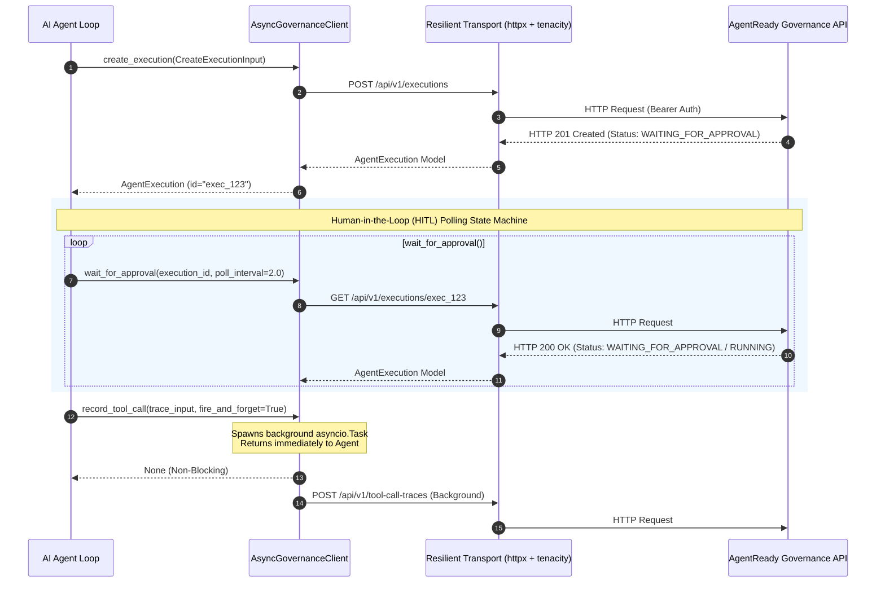
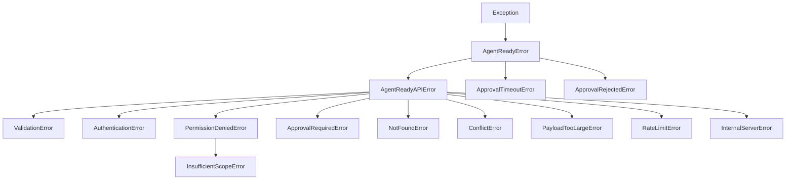

# AgentReady Governance SDK

<p align="center">
  <a href="https://github.com/agentready/agentready-governance-sdk">=3.12-blue.svg" alt="Python Version"></a>
  <a href="https://github.com/agentready/agentready-governance-sdk"></a>
  <a href="https://github.com/agentready/agentready-governance-sdk/actions"></a>
  <a href="https://github.com/astral-sh/ruff"></a>
  <a href="https://github.com/psf/black"></a>
  <a href="https://opensource.org/licenses/MIT"></a>
</p>

Official Python client library for the **AgentReady Governance Platform**.

The `agentready-governance-sdk` enables any Python AI agent framework (LangGraph, AutoGen, LlamaIndex, CrewAI, or custom agent loops) to integrate directly into enterprise governance controls—including real-time policy evaluation, human-in-the-loop (HITL) approval gates, capability feature flags, audit logging, and high-throughput tool call tracing—without writing custom security infrastructure.

---

## 📑 Table of Contents

- [📌 Overview](#-overview)
- [🏗️ Architecture Overview](#️-architecture-overview)
- [⚡ Key Features](#-key-features)
- [📦 Installation](#-installation)
- [⚙️ Configuration \& Setup](#️-configuration--setup)
- [🚀 Quickstart](#-quickstart)
  - [Asynchronous Client (`AsyncGovernanceClient`)](#asynchronous-client-asyncgovernanceclient)
  - [Synchronous Client (`GovernanceClient`)](#synchronous-client-governanceclient)
- [📖 Comprehensive API Guide](#-comprehensive-api-guide)
  - [1. Agent Executions](#1-agent-executions)
  - [2. Human-In-The-Loop (HITL) \& Approval Gates](#2-human-in-the-loop-hitl--approval-gates)
  - [3. Feature Flags \& Capability Controls](#3-feature-flags--capability-controls)
  - [4. Non-Blocking Tool Call Tracing](#4-non-blocking-tool-call-tracing)
  - [5. Audit Logs \& Observability Dashboard](#5-audit-logs--observability-dashboard)
- [🛡️ Exception Hierarchy \& Handling](#️-exception-hierarchy--handling)
- [🔄 Resilient Transport \& Retry Policy](#-resilient-transport--retry-policy)
- [📐 Pydantic V2 Domain Models \& Enums](#-pydantic-v2-domain-models--enums)
- [📂 Project Structure](#-project-structure)
- [🧪 Development \& Testing](#-development--testing)
- [📄 License](#-license)

---

## 📌 Overview

The **AgentReady Governance SDK** serves as the security and compliance layer between enterprise AI agents and sensitive backend infrastructure. It provides structured mechanisms to enforce governance policies before, during, and after agent tool execution.

```
+-------------------------------------------------------------------------+
|                          Enterprise AI Agent                            |
|             (LangGraph / AutoGen / LlamaIndex / Custom Loop)            |
+-------------------------------------------------------------------------+
                                    |
                                    v
+-------------------------------------------------------------------------+
|                     AgentReady Governance SDK                           |
|  - Dual Async/Sync HTTP Clients (httpx)                                 |
|  - Typed Pydantic V2 Validation & Serialization                         |
|  - Resilient Tenacity Retry Policy (Exponential Jitter + Retry-After)   |
|  - Background Fire-and-Forget Tool Tracing Task Queue                   |
+-------------------------------------------------------------------------+
                                    |
                                    v
+-------------------------------------------------------------------------+
|                    AgentReady Governance API Platform                   |
|  - Policy Engine & Risk Scoring                                         |
|  - Human-in-the-Loop (HITL) Approval Workflows                          |
|  - Capability Feature Flags & Gate Rules                                |
|  - Audit Log Ledger & Real-Time Observability Dashboard                 |
+-------------------------------------------------------------------------+
```

---

## 🏗️ Architecture Overview

The SDK architecture is designed for zero runtime overhead on agent reasoning loops while guaranteeing enterprise-grade durability:



---

## ⚡ Key Features

- 🔄 **Dual Async & Sync Support**: Complete parity between `AsyncGovernanceClient` (built on `httpx.AsyncClient`) and `GovernanceClient` (synchronous wrapper).
- 🔒 **Typed Pydantic V2 Models**: Strictly validated domain entities supporting both Python `snake_case` attributes and API `camelCase` JSON payloads.
- 🧑‍⚖️ **Human-In-The-Loop (HITL) Workflows**: Built-in state machine (`wait_for_approval`) with automatic polling, configurable timeouts, and rejection detection.
- 🚀 **Non-Blocking Tool Tracing**: High-throughput tool call recording with `fire_and_forget=True` to eliminate tracing latency from agent execution cycles.
- 🛡️ **Resilient Transport Layer**: Automatic exponential retry policies via `tenacity` for transient HTTP errors (429 Rate Limits and 500 Internal Server Errors), honoring HTTP `Retry-After` headers.
- 📊 **Audit & Observability**: Direct access to organization audit logs and live dashboard metrics.

---

## 📦 Installation

Install the package from PyPI using `pip`:

```bash
pip install agentready-governance-sdk
```

Or add it to your project using `poetry`:

```bash
poetry add agentready-governance-sdk
```

Or using `uv`:

```bash
uv add agentready-governance-sdk
```

### Requirements

- **Python**: `>= 3.12`
- **Dependencies**: `httpx >= 0.27`, `pydantic >= 2.0`, `tenacity >= 8.0`

---

## ⚙️ Configuration & Setup

Both `AsyncGovernanceClient` and `GovernanceClient` accept optional client configuration parameters:

| Parameter | Type | Default | Description |
| :--- | :--- | :--- | :--- |
| `api_key` | `str` | *Required* | AgentReady Governance API Secret Key (e.g. `agt_secret_...`). |
| `base_url` | `str` | `"http://localhost:3000"` | Governance API base server endpoint URL. |
| `timeout` | `float` | `30.0` | Maximum HTTP request timeout in seconds. |
| `max_retries` | `int` | `3` | Maximum retry attempts for transient `429` and `500` HTTP status responses. |

```python
from agentready_governance_sdk import AsyncGovernanceClient

client = AsyncGovernanceClient(
    api_key="agt_secret_key_prod_98765",
    base_url="https://api.agentready.ai",
    timeout=15.0,
    max_retries=5,
)
```

---

## 🚀 Quickstart

### Asynchronous Client (`AsyncGovernanceClient`)

Use `AsyncGovernanceClient` in modern `asyncio`-based agent runtimes:

```python
import asyncio
from agentready_governance_sdk import (
    AsyncGovernanceClient,
    CreateExecutionInput,
    CreateToolCallTraceInput,
    ExecutionStatus,
    ToolCallStatus,
)

async def main():
    async with AsyncGovernanceClient(api_key="agt_secret_key_123") as client:
        # 1. Register an agent execution request
        execution = await client.create_execution(
            CreateExecutionInput(
                project_id="proj_infrastructure",
                agent_id="agent_sre_bot",
                objective="Execute production database schema migration",
                risk_score=85,
            )
        )
        print(f"Execution created: {execution.id} | Status: {execution.status}")

        # 2. If gated by policy, wait for human-in-the-loop approval
        if execution.status == ExecutionStatus.WAITING_FOR_APPROVAL:
            print("Execution requires human approval. Waiting for decision...")
            execution = await client.wait_for_approval(
                execution_id=execution.id,
                poll_interval=2.0,
                timeout=300.0,
            )

        print(f"Execution approved and running! Status: {execution.status}")

        # 3. Record tool call traces (non-blocking fire-and-forget by default)
        await client.record_tool_call(
            CreateToolCallTraceInput(
                execution_id=execution.id,
                agent_id="agent_sre_bot",
                tool_name="db_migrate",
                status=ToolCallStatus.SUCCEEDED,
                input={"target_version": "2.4.0"},
                output={"applied_migrations": 3},
                latency_ms=145,
            ),
            fire_and_forget=True,
        )

        # 4. Mark execution completed
        await client.update_execution(
            execution.id,
            {"status": ExecutionStatus.SUCCEEDED, "output": {"migrated": True}},
        )

if __name__ == "__main__":
    asyncio.run(main())
```

---

### Synchronous Client (`GovernanceClient`)

For traditional synchronous codebases or frameworks:

```python
from agentready_governance_sdk import (
    GovernanceClient,
    CreateExecutionInput,
    ExecutionStatus,
    ToolCallStatus,
)

with GovernanceClient(api_key="agt_secret_key_123") as client:
    # 1. Check feature flags before executing restricted action
    flags = client.list_feature_flags(agent_id="agent_sre_bot")
    print(f"Active feature flags: {len(flags)}")

    # 2. Create execution (accepts dict or Pydantic input model)
    execution = client.create_execution(
        {
            "projectId": "proj_infrastructure",
            "agentId": "agent_sre_bot",
            "objective": "Inspect audit logs",
        }
    )

    # 3. Wait for approval synchronously
    if execution.status == ExecutionStatus.WAITING_FOR_APPROVAL:
        execution = client.wait_for_approval(execution.id, timeout=60.0)

    # 4. Record tool call (synchronous calls always block and return ToolCallTrace)
    trace = client.record_tool_call(
        {
            "executionId": execution.id,
            "agentId": "agent_sre_bot",
            "toolName": "fetch_logs",
            "status": ToolCallStatus.SUCCEEDED,
            "latencyMs": 85,
        }
    )
    print(f"Recorded tool call trace: {trace.id}")
```

---

## 📖 Comprehensive API Guide

### 1. Agent Executions

Executions represent task objectives submitted by agents.

```python
# Create an execution using Pydantic model
execution = await client.create_execution(
    CreateExecutionInput(
        project_id="proj_compliance",
        agent_id="agent_fin_ops",
        objective="Process wire transfer refund",
        risk_score=90,
        metadata={"amount_usd": 15000},
    )
)

# Fetch execution by ID
exec_details = await client.get_execution("exec_abc123")

# List executions with filters
running_execs = await client.list_executions(
    project_id="proj_compliance",
    status=ExecutionStatus.RUNNING,
)

# Update execution status & output
updated_exec = await client.update_execution(
    "exec_abc123",
    {"status": ExecutionStatus.SUCCEEDED, "output": {"refund_id": "ref_9988"}},
)
```

---

### 2. Human-In-The-Loop (HITL) & Approval Gates

Manage governance approval gates and automate human approval polling.

```python
# List configured approval gates
gates = await client.list_approval_gates()

# Create or update an approval gate rule
gate = await client.upsert_approval_gate(
    {
        "capability": "db_drop_table",
        "mode": "REQUIRE_APPROVAL",
        "minRiskScore": 75,
        "description": "Require admin signoff before dropping database tables",
    }
)

# Wait for human approval with custom polling strategy
try:
    approved_execution = await client.wait_for_approval(
        execution_id="exec_abc123",
        poll_interval=1.5,  # Poll every 1.5 seconds
        timeout=120.0,       # Timeout after 2 minutes
    )
    print(f"Approved! Proceeding with execution: {approved_execution.id}")
except ApprovalRejectedError as e:
    print(f"Execution was rejected or cancelled: {e}")
except ApprovalTimeoutError as e:
    print(f"Timed out waiting for human review: {e}")
```

---

### 3. Feature Flags & Capability Controls

Control agent capabilities dynamically at runtime without redeploying agent code.

```python
from agentready_governance_sdk import FeatureFlagState

# List feature flags for a specific agent
flags = await client.list_feature_flags(agent_id="agent_sre_bot")

# Toggle a capability feature flag
toggled = await client.toggle_feature_flag(
    capability="shell_exec",
    state=FeatureFlagState.DISABLED,
    agent_id="agent_sre_bot",
)

# Upsert feature flag configuration
upserted = await client.upsert_feature_flag(
    {
        "capability": "web_scrape",
        "state": "ENABLED",
        "agentId": "agent_sre_bot",
        "description": "Allow web scraping for public domain research",
    }
)
```

---

### 4. Non-Blocking Tool Call Tracing

Record detailed tool execution telemetry for auditability and compliance.

```python
# Non-blocking fire-and-forget tracing (returns None instantly)
await client.record_tool_call(
    CreateToolCallTraceInput(
        execution_id="exec_123",
        agent_id="agent_sre_bot",
        tool_name="aws_ec2_stop_instance",
        status=ToolCallStatus.SUCCEEDED,
        input={"instance_id": "i-0123456789abcdef0"},
        latency_ms=320,
    ),
    fire_and_forget=True,
)

# Await response and receive parsed ToolCallTrace model
trace = await client.record_tool_call(
    trace_input,
    fire_and_forget=False,
)

# Update existing tool call trace
updated_trace = await client.update_tool_call(
    trace_id="trc_998877",
    input={"status": ToolCallStatus.FAILED, "error": "Connection timed out"},
)
```

---

### 5. Audit Logs & Observability Dashboard

Inspect security audit history and fetch organizational dashboard metrics.

```python
# Query recent audit log entries
logs = await client.list_audit_logs(limit=25)
for log in logs:
    print(f"[{log.timestamp}] {log.actor_type} - {log.action}: {log.description}")

# Fetch observability metrics dashboard
dashboard = await client.get_dashboard()
print("System Health Metrics:", dashboard)
```

---

## 🛡️ Exception Hierarchy & Handling

All SDK exceptions derive from `AgentReadyError`. Standard HTTP response errors inherit from `AgentReadyAPIError` and include `status_code`, string error `code`, human-readable `message`, and structured `details`.



### Exception Reference Table

| Exception Class | Parent Class | HTTP Status | API Error Code | Cause / Description |
| :--- | :--- | :---: | :--- | :--- |
| `AgentReadyError` | `Exception` | - | - | Base exception for all SDK errors. |
| `AgentReadyAPIError` | `AgentReadyError` | `4xx` / `5xx` | Variable | Base class for HTTP API response errors. |
| `ValidationError` | `AgentReadyAPIError` | `400` | `VALIDATION_ERROR` | Request payload or parameter validation failed. |
| `AuthenticationError` | `AgentReadyAPIError` | `401` | `UNAUTHENTICATED` | Missing or invalid API key credential. |
| `PermissionDeniedError` | `AgentReadyAPIError` | `403` | `PERMISSION_DENIED` | Tenant mismatch or insufficient permissions. |
| `InsufficientScopeError` | `PermissionDeniedError` | `403` | `INSUFFICIENT_SCOPE` | API key lacks required scope for requested action. |
| `ApprovalRequiredError` | `AgentReadyAPIError` | `403` | `APPROVAL_REQUIRED` | Operation gated by policy requiring human approval. |
| `NotFoundError` | `AgentReadyAPIError` | `404` | `NOT_FOUND` | Requested entity (execution, gate, flag) not found. |
| `ConflictError` | `AgentReadyAPIError` | `409` | `CONFLICT` | Entity state conflict (e.g. duplicate resource). |
| `PayloadTooLargeError` | `AgentReadyAPIError` | `413` | `PAYLOAD_TOO_LARGE` | Request payload exceeds maximum server byte size. |
| `RateLimitError` | `AgentReadyAPIError` | `429` | `RATE_LIMIT_EXCEEDED` | Request quota exceeded (carries `retry_after` if header present). |
| `InternalServerError` | `AgentReadyAPIError` | `500` | `INTERNAL_SERVER_ERROR` | Server-side internal error encountered. |
| `ApprovalTimeoutError` | `AgentReadyError` | - | - | SDK control flow exception when `wait_for_approval` times out. |
| `ApprovalRejectedError` | `AgentReadyError` | - | - | SDK control flow exception when execution status is `FAILED` or `CANCELLED`. |

### Error Handling Example

```python
from agentready_governance_sdk import (
    AsyncGovernanceClient,
    RateLimitError,
    AuthenticationError,
    AgentReadyAPIError,
)

async with AsyncGovernanceClient(api_key="invalid_key") as client:
    try:
        await client.list_executions()
    except AuthenticationError as e:
        print(f"Auth error ({e.status_code}): {e.message}")
    except RateLimitError as e:
        print(f"Rate limited! Retry after {e.retry_after} seconds.")
    except AgentReadyAPIError as e:
        print(f"API Error [{e.code}]: {e.message} (Details: {e.details})")
```

---

## 🔄 Resilient Transport & Retry Policy

The transport layer (`_transport.py`) automatically wraps API calls with exponential backoff retry logic using `tenacity`.

- **Retryable Triggers**: `RateLimitError` (`429`) and `InternalServerError` (`500`).
- **Backoff Strategy**: Exponential backoff with jitter (`min=1.0s`, `max=60.0s`).
- **`Retry-After` Header Support**: If the server returns a `Retry-After` header during a rate limit response, the SDK honors the exact delay requested by the server before retrying.

---

## 📐 Pydantic V2 Domain Models & Enums

### Pydantic Models

All data transfer objects derive from `BaseApiModel` (`pydantic.BaseModel` configured with `populate_by_name=True`):

- **Executions**: `AgentExecution`, `CreateExecutionInput`, `UpdateExecutionInput`
- **Approval Gates**: `ApprovalGate`, `UpsertApprovalGateInput`, `ApprovalRequest`, `ReviewApprovalRequestInput`
- **Feature Flags**: `FeatureFlag`, `UpsertAgentFeatureFlagInput`
- **Tool Traces**: `ToolCallTrace`, `CreateToolCallTraceInput`, `UpdateToolCallTraceInput`
- **Audit Logs**: `AuditLogEntry`

### Common Enums

- **`ExecutionStatus`**: `QUEUED`, `RUNNING`, `WAITING_FOR_APPROVAL`, `SUCCEEDED`, `FAILED`, `CANCELLED`
- **`ToolCallStatus`**: `PENDING`, `RUNNING`, `SUCCEEDED`, `FAILED`, `BLOCKED`
- **`ApprovalGateMode`**: `AUTOMATIC`, `REQUIRE_APPROVAL`, `BLOCKED`
- **`FeatureFlagState`**: `ENABLED`, `DISABLED`
- **`ApprovalStatus`**: `PENDING`, `APPROVED`, `REJECTED`, `EXPIRED`
- **`ActorType`**: `USER`, `AGENT`, `SYSTEM`

---

## 📂 Project Structure

```
agentready-governance-sdk/
├── agentready_governance_sdk/
│   ├── __init__.py           # Package exports (Clients, Models, Enums, Exceptions)
│   ├── _constants.py         # Default configuration values
│   ├── _transport.py         # HTTP error status handler & tenacity retry policies
│   ├── _version.py           # SDK version definition
│   ├── client.py             # AsyncGovernanceClient implementation
│   ├── exceptions.py         # Custom SDK exception hierarchy
│   ├── sync_client.py        # GovernanceClient synchronous wrapper
│   └── models/
│       ├── __init__.py       # Model package re-exports
│       ├── audit.py          # AuditLogEntry model
│       ├── base.py           # BaseApiModel base configuration
│       ├── common.py         # Shared SDK Enum definitions
│       ├── executions.py     # AgentExecution models
│       ├── governance.py     # FeatureFlag & ApprovalGate models
│       └── traces.py         # ToolCallTrace models
├── tests/
│   ├── test_async_client.py  # Unit tests for AsyncGovernanceClient
│   ├── test_async_client_approval.py # Unit tests for approval polling
│   ├── test_async_client_executions.py # Unit tests for executions API
│   ├── test_enums.py         # Enum validation tests
│   ├── test_exceptions.py    # Exception mapping unit tests
│   ├── test_models.py        # Pydantic V2 serialization & alias tests
│   ├── test_sync_client.py   # Unit tests for GovernanceClient
│   └── test_transport.py     # Retry strategy & error mapping tests
├── pyproject.toml            # Poetry project dependencies & tools config
└── README.md                 # SDK Documentation
```

---

## 🧪 Development & Testing

### Setup Environment

Clone the repository and install dependencies via Poetry:

```bash
git clone https://github.com/agentready/agentready-governance-sdk.git
cd agentready-governance-sdk
poetry install
```

### Run Test Suite

Run the full pytest suite:

```bash
poetry run pytest
```

### Code Quality & Formatting

Lint and format code using `ruff` and `black`:

```bash
# Check code style with Ruff
poetry run ruff check .

# Format code with Black
poetry run black --check .
```

---

## 📄 License

This project is released under the **MIT License**. See the `LICENSE` file for details.
