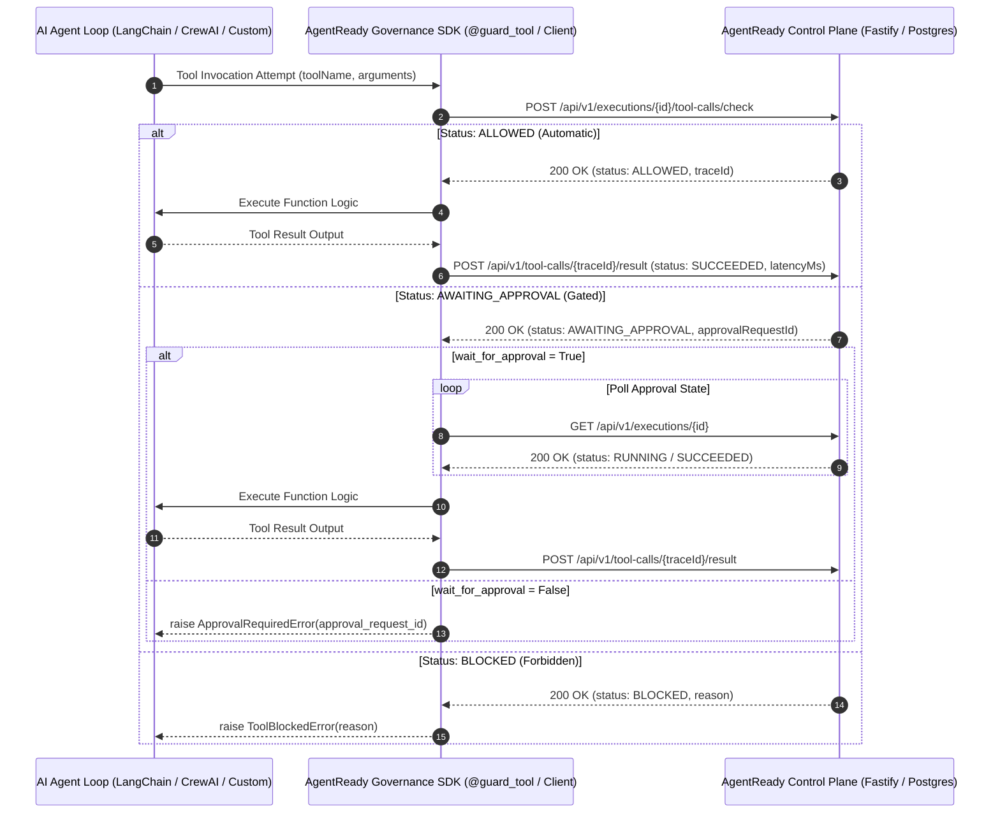
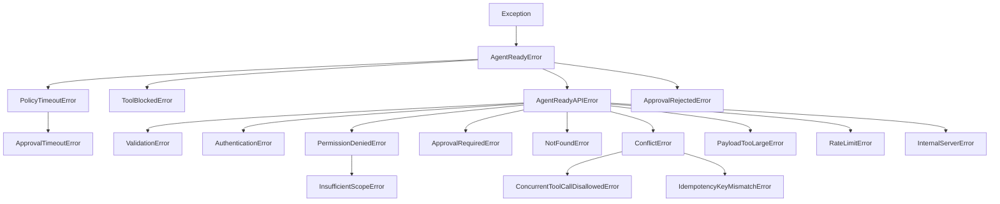

# AgentReady Governance SDK

<p align="center">
  <a href="https://github.com/Deadeye102000/Agentready-governance-sdk">=3.12-blue.svg" alt="Python Version"></a>
  <a href="https://github.com/Deadeye102000/Agentready-governance-sdk"></a>
  <a href="https://github.com/Deadeye102000/Agentready-governance-sdk/actions/workflows/ci.yml"></a>
  <a href="https://github.com/Deadeye102000/Agentready-governance-sdk/actions"></a>
  <a href="https://github.com/astral-sh/ruff"></a>
  <a href="https://github.com/psf/black"></a>
  <a href="https://opensource.org/licenses/MIT"></a>
</p>

Official Python client library for the **[AgentReady Governance Platform](https://github.com/Deadeye102000/Agentready)**.

The `agentready-governance-sdk` enables any Python AI agent framework (**LangChain**, **LangGraph**, **CrewAI**, **AutoGen**, **LlamaIndex**, or custom agent loops) to integrate directly into enterprise governance controls—including pre-flight tool checking, real-time policy evaluation, human-in-the-loop (HITL) approval gates, capability feature flags, audit logging, and high-throughput tool call tracing—without building custom security infrastructure.

---

## 📑 Table of Contents

- [📌 Overview](#-overview)
- [🏗️ Architecture Overview](#️-architecture-overview)
- [⚡ Key Features](#-key-features)
- [📦 Installation](#-installation)
  - [Requirements](#requirements)
  - [Optional Framework Extras](#optional-framework-extras)
- [⚙️ Configuration & Setup](#️-configuration--setup)
- [🚀 Quickstart](#-quickstart)
  - [Asynchronous Client (`AsyncGovernanceClient` / `AsyncAgentReadyClient`)](#asynchronous-client-asyncgovernanceclient--asyncagentreadyclient)
  - [Synchronous Client (`GovernanceClient` / `AgentReadyClient`)](#synchronous-client-governanceclient--agentreadyclient)
- [🔌 Plug-and-Play Framework Adapters](#-plug-and-play-framework-adapters)
  - [1. Universal Python Tool Guard (`@guard_tool`)](#1-universal-python-tool-guard-guard_tool)
  - [2. Multi-Agent Delegation Context (`agentready_execution`)](#2-multi-agent-delegation-context-agentready_execution)
  - [3. LangChain & LangGraph Integration (`AgentReadyCallbackHandler`)](#3-langchain--langgraph-integration-agentreadycallbackhandler)
  - [4. CrewAI Integration (`AgentReadyCrewAITool` & `@guard_crew_tool`)](#4-crewai-integration-agentreadycrewaitool--guard_crew_tool)
- [📖 Comprehensive API Guide](#-comprehensive-api-guide)
  - [1. Agent Executions](#1-agent-executions)
  - [2. Human-In-The-Loop (HITL) & Approval Gates](#2-human-in-the-loop-hitl--approval-gates)
  - [3. Feature Flags & Capability Controls](#3-feature-flags--capability-controls)
  - [4. Pre-Flight Tool Call Governance & Result Reporting](#4-pre-flight-tool-call-governance--result-reporting)
  - [5. Deterministic Trajectory Evaluator (Cross-Language Parity)](#5-deterministic-trajectory-evaluator-cross-language-parity)
  - [6. Task Contracts, Eval Suites & Regression Detection](#6-task-contracts-eval-suites--regression-detection)
  - [7. Machine API Key Management](#7-machine-api-key-management)
  - [8. Non-Blocking Tool Call Tracing](#8-non-blocking-tool-call-tracing)
  - [9. Audit Logs & Observability Dashboard](#9-audit-logs--observability-dashboard)
- [🛡️ Exception Hierarchy & Handling](#️-exception-hierarchy--handling)
- [🔄 Resilient Transport & Retry Policy](#-resilient-transport--retry-policy)
- [📐 Pydantic V2 Domain Models & Enums](#-pydantic-v2-domain-models--enums)
- [📂 Project Structure](#-project-structure)
- [🧪 Development & Testing](#-development--testing)
- [📄 License](#-license)

---

## 📌 Overview

The **AgentReady Governance SDK** serves as the security and compliance layer between enterprise AI agents and backend infrastructure. It provides structured mechanisms to enforce governance policies before, during, and after agent tool execution.

```
+-------------------------------------------------------------------------+
|                          Enterprise AI Agent                            |
|             (LangGraph / CrewAI / AutoGen / LlamaIndex / Custom)        |
+-------------------------------------------------------------------------+
                                    |
                                    v
+-------------------------------------------------------------------------+
|                     AgentReady Governance SDK                           |
|  - Framework Adapters (@guard_tool, CallbackHandlers, CrewAI Mixins)   |
|  - Dual Async/Sync Clients (httpx) & Multi-Agent Context Tracking       |
|  - Typed Pydantic V2 Validation & Serialization                         |
|  - Resilient Tenacity Retry Policy (Exponential Jitter + Retry-After)   |
|  - Offline Trajectory Policy Evaluator (Shared Spec with TypeScript)    |
|  - Background Fire-and-Forget Tool Tracing Task Queue                   |
+-------------------------------------------------------------------------+
                                    |
                                    v
+-------------------------------------------------------------------------+
|                    AgentReady Governance API Platform                   |
|                  (Deadeye102000/Agentready Monorepo)                    |
|  - Pre-flight Tool Authorization (/tool-calls/check)                    |
|  - Human-in-the-Loop (HITL) Approval Workflows                          |
|  - Task Contracts & Trajectory Policies                                 |
|  - Dynamic Capability Feature Flags                                     |
|  - Immutable Audit Ledger & Observability Metrics                       |
+-------------------------------------------------------------------------+
```

---

## 🏗️ Architecture Overview

The SDK architecture guarantees enterprise safety while preserving low agent reasoning latency:



---

## ⚡ Key Features

- **Plug-and-Play Framework Adapters**: Drop-in integrations for **LangChain/LangGraph** (`AgentReadyCallbackHandler`), **CrewAI** (`AgentReadyCrewAITool`, `@guard_crew_tool`), and vanilla Python functions (`@guard_tool`).
- **Multi-Agent Context Tracking**: Seamless `contextvars` management (`agentready_execution`) tracking multi-agent delegation chains without parameter threading.
- **Dual Asynchronous & Synchronous Interfaces**: Identical functionality across `AsyncGovernanceClient` (`AsyncAgentReadyClient`) and `GovernanceClient` (`AgentReadyClient`).
- **Pre-Flight Tool Call Governance**: Direct HTTP verification via `/api/v1/executions/{id}/tool-calls/check` with auto-generated idempotency keys.
- **Human-in-the-Loop (HITL) Workflows**: Configurable polling with timeout and interval controls for gated tasks and single-flight concurrency.
- **Cross-Language Policy Evaluator**: Deterministic offline trajectory policy evaluator verified against the canonical upstream test suite in `packages/agent-contracts`.
- **Dynamic Feature Flags**: Runtime capability toggles (`ENABLED` / `DISABLED`) with agent-specific targeting.
- **Resilient Transport**: Auto-retry with jittered backoff on `429 Too Many Requests` and `500 Internal Server Error`, honoring server `Retry-After` headers.
- **Zero Drift Protection**: Automated CI drift test ensuring test fixtures match `Deadeye102000/Agentready` upstream commits.

---

## 📦 Installation

Install the core package from PyPI:

```bash
pip install agentready-governance-sdk
```

Or using `poetry`:

```bash
poetry add agentready-governance-sdk
```

Or using `uv`:

```bash
uv add agentready-governance-sdk
```

### Requirements

- **Python**: `>= 3.12`
- **Core Dependencies**: `httpx >= 0.27`, `pydantic >= 2.0`, `tenacity >= 8.0`

### Optional Framework Extras

Install framework adapters on demand without polluting base environments:

```bash
# With LangChain & LangGraph integration
pip install "agentready-governance-sdk[langchain]"

# With CrewAI integration
pip install "agentready-governance-sdk[crewai]"

# With all framework adapters
pip install "agentready-governance-sdk[all]"
```

Or with Poetry:

```bash
poetry add agentready-governance-sdk -E all
```

---

## ⚙️ Configuration & Setup

Both `AsyncGovernanceClient` and `GovernanceClient` accept client configuration parameters:

| Parameter | Type | Default | Description |
| :--- | :--- | :--- | :--- |
| `api_key` | `str` | *Required* | AgentReady Governance API Secret Key (e.g. `agt_secret_...`). |
| `base_url` | `str` | `"http://localhost:3000"` | Governance API base server URL (or port `3001` in API daemon mode). |
| `timeout` | `float` | `30.0` | HTTP request timeout in seconds. |
| `max_retries` | `int` | `3` | Maximum retry attempts for transient `429` and `500` HTTP responses. |

```python
from agentready_governance_sdk import AsyncGovernanceClient

client = AsyncGovernanceClient(
    api_key="agt_secret_key_prod_98765",
    base_url="https://api.agentready.ai",
    timeout=15.0,
    max_retries=5,
)
```

---

## 🚀 Quickstart

### Asynchronous Client (`AsyncGovernanceClient` / `AsyncAgentReadyClient`)

```python
import asyncio
from agentready_governance_sdk import (
    AsyncGovernanceClient,
    CreateExecutionInput,
    CreateToolCallTraceInput,
    ExecutionStatus,
    ToolCallStatus,
)


async def main():
    async with AsyncGovernanceClient(api_key="agt_secret_key_123") as client:
        # 1. Register an agent execution
        execution = await client.create_execution(
            CreateExecutionInput(
                project_id="proj_infrastructure",
                agent_id="agent_sre_bot",
                objective="Execute database schema migration",
                risk_score=85,
            )
        )
        print(f"Execution created: {execution.id} | Status: {execution.status}")

        # 2. Wait for human approval if gated by policy
        if execution.status == ExecutionStatus.WAITING_FOR_APPROVAL:
            print("Execution requires human approval. Waiting...")
            execution = await client.wait_for_approval(
                execution_id=execution.id,
                poll_interval=2.0,
                timeout=300.0,
            )

        print(f"Execution approved! Status: {execution.status}")

        # 3. Record tool call trace (non-blocking fire-and-forget by default)
        await client.record_tool_call(
            CreateToolCallTraceInput(
                execution_id=execution.id,
                agent_id="agent_sre_bot",
                tool_name="db_migrate",
                status=ToolCallStatus.SUCCEEDED,
                input={"target_version": "2.4.0"},
                output={"applied_migrations": 3},
                latency_ms=145,
            ),
            fire_and_forget=True,
        )

        # 4. Mark execution completed
        await client.update_execution(
            execution.id,
            {"status": ExecutionStatus.SUCCEEDED, "output": {"migrated": True}},
        )


if __name__ == "__main__":
    asyncio.run(main())
```

---

### Synchronous Client (`GovernanceClient` / `AgentReadyClient`)

```python
from agentready_governance_sdk import (
    ExecutionStatus,
    GovernanceClient,
    ToolCallStatus,
)

client = GovernanceClient(api_key="agt_secret_key_123")

execution = client.create_execution(
    {
        "projectId": "proj_infra",
        "agentId": "agent_sre_bot",
        "objective": "Restart production server daemon",
        "riskScore": 60,
    }
)

if execution.status == ExecutionStatus.WAITING_FOR_APPROVAL:
    execution = client.wait_for_approval(execution.id, timeout=60.0)

trace = client.record_tool_call(
    {
        "executionId": execution.id,
        "agentId": "agent_sre_bot",
        "toolName": "fetch_logs",
        "status": ToolCallStatus.SUCCEEDED,
        "latencyMs": 85,
    }
)
print(f"Recorded tool call trace: {trace.id}")
```

---

## 🔌 Plug-and-Play Framework Adapters

### 1. Universal Python Tool Guard (`@guard_tool`)

Wrap any standard Python function or `async` function with `@guard_tool` to inject real-time governance:

```python
from agentready_governance_sdk import (
    ApprovalRequiredError,
    ToolBlockedError,
    agentready_execution,
    guard_tool,
)


# Standard synchronous function
@guard_tool(tool_name="database_query")
def run_query(sql: str) -> list[dict]:
    # Runs only if policy allows. Latency and result are automatically reported.
    return [{"id": 1, "name": "Alice"}]


# Asynchronous function with approval polling
@guard_tool(tool_name="deploy_service", wait_for_approval=True, timeout=120.0)
async def deploy_service(environment: str) -> str:
    return f"Successfully deployed to {environment}"


# Run inside a multi-agent execution context
with agentready_execution(execution_id="exec_9876", agent_id="agent_backend"):
    try:
        results = run_query("SELECT * FROM users")
    except ToolBlockedError as err:
        print(f"Tool blocked by policy: {err.reason}")
    except ApprovalRequiredError as err:
        print(f"Human approval required: Request ID {err.approval_request_id}")
```

### 2. Multi-Agent Delegation Context (`agentready_execution`)

Use `agentready_execution` context managers so sub-agents, nested tools, and delegation hops automatically inherit parent execution context without parameter threading:

```python
from agentready_governance_sdk import agentready_execution, guard_tool


@guard_tool
def fetch_financials(symbol: str) -> dict:
    return {"symbol": symbol, "revenue": 1000000}


with agentready_execution("exec_root_42", "supervisor_agent"):
    # Delegation chain: ['supervisor_agent']
    print("Supervisor delegating task...")

    with agentready_execution("exec_root_42", "financial_analyst"):
        # Delegation chain: ['supervisor_agent', 'financial_analyst']
        # Tool call inherits 'exec_root_42' automatically
        data = fetch_financials("GOOGL")
```

### 3. LangChain & LangGraph Integration (`AgentReadyCallbackHandler`)

Drop `AgentReadyCallbackHandler` directly into any LangChain ReAct agent or LangGraph compiled graph:

```python
from agentready_governance_sdk import AgentReadyCallbackHandler
from langchain import hub
from langchain.agents import AgentExecutor, create_react_agent
from langchain_community.tools import DuckDuckGoSearchRun
from langchain_openai import ChatOpenAI

# 1. Initialize governance callback handler
governance_callback = AgentReadyCallbackHandler(
    execution_id="exec_langchain_101",
    raise_on_blocked=True,  # Raises ToolBlockedError if blocked
    wait_for_approval=False,  # Raises ApprovalRequiredError if gated
)

# 2. Setup standard LangChain agent
tools = [DuckDuckGoSearchRun()]
prompt = hub.pull("hwchase17/react")
llm = ChatOpenAI(model="gpt-4o", temperature=0)
agent = create_react_agent(llm, tools, prompt)

agent_executor = AgentExecutor(
    agent=agent,
    tools=tools,
    callbacks=[governance_callback],  # Injects pre-flight checks & audit ledger
    verbose=True,
)

# 3. Run agent with governance protection
try:
    response = agent_executor.invoke({"input": "What are the latest AI safety guidelines?"})
    print(response["output"])
except Exception as e:
    print(f"Governance enforcement: {e}")
```

### 4. CrewAI Integration (`AgentReadyCrewAITool` & `@guard_crew_tool`)

Seamlessly guard CrewAI agents using either `AgentReadyCrewAITool` or `@guard_crew_tool`:

```python
from agentready_governance_sdk import (
    AgentReadyCrewAITool,
    agentready_execution,
    guard_crew_tool,
)
from crewai import Agent, Crew, Process, Task
from crewai.tools import BaseTool, tool


# Pattern A: Decorator on custom functions with CrewAI's @tool
@tool("Database Reader")
@guard_crew_tool
def read_database(query: str) -> str:
    """Reads records from the customer database."""
    return f"Results for: {query}"


# Pattern B: Wrapping existing CrewAI BaseTool classes
class FileWriteTool(BaseTool):
    name: str = "file_writer"
    description: str = "Writes logs or files to disk"

    def _run(self, filepath: str, content: str) -> str:
        return f"Wrote {len(content)} bytes to {filepath}"


guarded_file_writer = AgentReadyCrewAITool(FileWriteTool())

# Define CrewAI agent with guarded tools
researcher = Agent(
    role="Enterprise Data Analyst",
    goal="Extract and summarize compliance reports",
    backstory="You are an enterprise analyst operating within strict security policies.",
    tools=[read_database, guarded_file_writer],
    verbose=True,
)

task = Task(
    description="Query user account records and save a summary report.",
    expected_output="Path to the saved report.",
    agent=researcher,
)

crew = Crew(
    agents=[researcher],
    tasks=[task],
    process=Process.sequential,
)

# Execute crew inside governed context
with agentready_execution("exec_crew_202", "researcher_agent"):
    result = crew.kickoff()
    print(result)
```

---

## 📖 Comprehensive API Guide

### 1. Agent Executions

Executions represent task objectives submitted by agents.

```python
# Create an execution
execution = await client.create_execution(
    CreateExecutionInput(
        project_id="proj_compliance",
        agent_id="agent_fin_ops",
        objective="Process wire transfer refund",
        risk_score=90,
        metadata={"amount_usd": 15000},
    )
)

# Fetch execution by ID
exec_details = await client.get_execution("exec_abc123")

# List executions with filters
running_execs = await client.list_executions(
    project_id="proj_compliance",
    status=ExecutionStatus.RUNNING,
)

# Update execution status & output
updated_exec = await client.update_execution(
    "exec_abc123",
    {"status": ExecutionStatus.SUCCEEDED, "output": {"refund_id": "ref_9988"}},
)
```

---

### 2. Human-In-The-Loop (HITL) & Approval Gates

Manage governance approval gates and automate human approval polling.

```python
# List configured approval gates
gates = await client.list_approval_gates()

# Create or update an approval gate rule
gate = await client.upsert_approval_gate(
    {
        "capability": "db_drop_table",
        "mode": "REQUIRE_APPROVAL",
        "minRiskScore": 75,
        "description": "Require admin signoff before dropping database tables",
    }
)

# Wait for human approval with custom polling strategy
try:
    approved_execution = await client.wait_for_approval(
        execution_id="exec_abc123",
        poll_interval=1.5,
        timeout=120.0,
    )
    print(f"Approved! Proceeding with execution: {approved_execution.id}")
except ApprovalRejectedError as e:
    print(f"Execution was rejected or cancelled: {e}")
except ApprovalTimeoutError as e:
    print(f"Timed out waiting for human review: {e}")
```

---

### 3. Feature Flags & Capability Controls

Control agent capabilities dynamically at runtime without redeploying code:

```python
# List feature flags for an agent
flags = await client.list_feature_flags(agent_id="agent_sre_bot")

# Toggle a capability feature flag (flips between ENABLED and DISABLED)
toggled = await client.toggle_feature_flag(
    capability="shell_exec",
    agent_id="agent_sre_bot",
)

# Upsert feature flag configuration
upserted = await client.upsert_feature_flag(
    {
        "capability": "web_scrape",
        "state": "ENABLED",
        "agentId": "agent_sre_bot",
        "description": "Allow web scraping for research",
    }
)
```

---

### 4. Pre-Flight Tool Call Governance & Result Reporting

Before executing sensitive tool calls, agents perform a pre-flight governance check. A UUID `idempotency_key` is auto-generated if none is supplied:

```python
from agentready_governance_sdk import (
    ReportToolCallResultInput,
    ToolCallDecision,
    ToolCallStatus,
)

# 1. Pre-flight check
check = await client.check_tool_call(
    execution_id="exec_123",
    tool_name="aws_ec2_stop_instance",
    arguments={"instance_id": "i-0123456789abcdef0"},
)

if check.decision == ToolCallDecision.ALLOW:
    # Execute the tool safely...
    result_output = {"status": "stopped"}
    # Report back the completion
    await client.report_tool_result(
        trace_id=check.tool_call_trace_id,
        input=ReportToolCallResultInput(
            status=ToolCallStatus.SUCCEEDED,
            output=result_output,
            is_final_action=False,
        ),
    )
elif check.decision == ToolCallDecision.WAIT_FOR_APPROVAL:
    print(f"Action requires human approval. Request ID: {check.approval_request_id}")
elif check.decision == ToolCallDecision.BLOCK:
    print(f"Tool call blocked: {check.reason} (consecutive blocks: {check.consecutive_blocks})")
```

---

### 5. Deterministic Trajectory Evaluator (Cross-Language Parity)

Evaluate agent execution trajectories against structured behavioral policies offline or in unit tests. Both Python and TypeScript share identical deterministic evaluation logic verified against a shared cross-language fixture suite (`tests/fixtures/trajectory_eval_cases.json`):

```python
from agentready_governance_sdk import (
    ExpectedStep,
    TrajectoryMode,
    TrajectoryPolicy,
    evaluate_trajectory_traces,
)

policy = TrajectoryPolicy(
    mode=TrajectoryMode.STRICT_SEQUENCE,
    expected_steps=[
        ExpectedStep(tool="search_web"),
        ExpectedStep(tool="read_file"),
        ExpectedStep(tool="summarize", required=False),
    ],
    forbidden_tools=["bash_eval"],
    max_tool_calls=5,
)

traces = [
    {"tool_name": "search_web", "step_index": 0},
    {"tool_name": "read_file", "step_index": 1},
]

evaluation = evaluate_trajectory_traces(traces, policy)
print(f"Passed: {evaluation.passed}, Score: {evaluation.score}")
# Passed: True, Score: 1.0 (matched 2 of 2 required steps)
```

---

### 6. Task Contracts, Eval Suites & Regression Detection

Define formal task contracts, run evaluation suites, and monitor behavioral regressions between releases:

```python
from agentready_governance_sdk import CreateTaskContractInput

# Create a contract with constraints
contract = await client.create_task_contract(
    CreateTaskContractInput(
        project_id="proj_1",
        name="Customer Support Contract",
        objective="Help users without issuing unauthorized refunds",
        allowed_tools=["fetch_order", "lookup_faq"],
        required_approvals=["issue_refund"],
    )
)

# Run full evaluation suite and check regression report
runs = await client.run_eval_suite(task_contract_id=contract.id)
regression = await client.get_regression_report(contract_id=contract.id)
if regression.delta and regression.delta < 0:
    print(f"Alert: Performance regression of {regression.delta:.2f} detected!")
```

---

### 7. Machine API Key Management

Generate scoped machine API keys directly from the SDK. The `raw_key` secret is returned only once at creation:

```python
from agentready_governance_sdk import ApiKeyScope, CreateApiKeyInput

# Create a new machine key for CI/CD
new_key = await client.create_api_key(
    CreateApiKeyInput(
        name="GitHub Actions Deployer",
        scopes=[ApiKeyScope.AGENT_EXECUTION_WRITE, ApiKeyScope.GOVERNANCE_READ],
    )
)
print("Save this key immediately:", new_key.raw_key)

# List and revoke keys
keys = await client.list_api_keys()
await client.revoke_api_key(new_key.api_key_record.id)
```

---

### 8. Non-Blocking Tool Call Tracing

Record tool execution telemetry for auditability and compliance:

```python
# Non-blocking fire-and-forget tracing (returns None instantly)
await client.record_tool_call(
    CreateToolCallTraceInput(
        execution_id="exec_123",
        agent_id="agent_sre_bot",
        tool_name="aws_ec2_stop_instance",
        status=ToolCallStatus.SUCCEEDED,
        input={"instance_id": "i-0123456789abcdef0"},
        latency_ms=320,
    ),
    fire_and_forget=True,
)

# Update existing tool call trace
updated_trace = await client.update_tool_call(
    trace_id="trc_998877",
    input={"status": ToolCallStatus.FAILED, "error": "Connection timed out"},
)
```

---

### 9. Audit Logs & Observability Dashboard

Inspect security audit history and fetch organizational dashboard metrics:

```python
# Query recent audit log entries
logs = await client.list_audit_logs(limit=25)
for log in logs:
    print(f"[{log.timestamp}] {log.actor_type} - {log.action}: {log.description}")

# Fetch observability metrics dashboard
dashboard = await client.get_dashboard()
print("System Health Metrics:", dashboard)
```

---

## 🛡️ Exception Hierarchy & Handling

All SDK exceptions derive from `AgentReadyError`. Standard HTTP response errors inherit from `AgentReadyAPIError` and include `status_code`, string error `code`, human-readable `message`, and structured `details`.



### Exception Reference Table

| Exception Class | Parent Class | HTTP Status | API Error Code | Cause / Description |
| :--- | :--- | :---: | :--- | :--- |
| `AgentReadyError` | `Exception` | - | - | Base exception for all SDK errors. |
| `AgentReadyAPIError` | `AgentReadyError` | `4xx` / `5xx` | Variable | Base class for HTTP API response errors. |
| `ToolBlockedError` | `AgentReadyError` | - | - | Raised when tool execution is forbidden by policy or feature flag. |
| `PolicyTimeoutError` | `AgentReadyError` | - | - | Raised when waiting for policy evaluation or approval times out. |
| `ValidationError` | `AgentReadyAPIError` | `400` | `VALIDATION_ERROR` | Request payload or parameter validation failed. |
| `AuthenticationError` | `AgentReadyAPIError` | `401` | `UNAUTHORIZED` | Missing or invalid API key credential. |
| `PermissionDeniedError` | `AgentReadyAPIError` | `403` | `FORBIDDEN` | Tenant mismatch or insufficient permissions. |
| `InsufficientScopeError` | `PermissionDeniedError` | `403` | `INSUFFICIENT_SCOPE` | API key lacks required scope for requested action. |
| `ApprovalRequiredError` | `AgentReadyAPIError` | `403` | `APPROVAL_REQUIRED` | Operation gated by policy requiring human approval. |
| `NotFoundError` | `AgentReadyAPIError` | `404` | `NOT_FOUND` | Requested entity (execution, gate, flag) not found. |
| `ConflictError` | `AgentReadyAPIError` | `409` | `CONFLICT` | Entity state conflict (e.g. duplicate resource). |
| `ConcurrentToolCallDisallowedError` | `ConflictError` | `409` | `CONCURRENT_TOOL_CALL_DISALLOWED` | Another tool call is already pending for this execution. |
| `IdempotencyKeyMismatchError` | `ConflictError` | `409` | `IDEMPOTENCY_KEY_MISMATCH` | Reused idempotency key with differing payload. |
| `PayloadTooLargeError` | `AgentReadyAPIError` | `413` | `PAYLOAD_TOO_LARGE` | Request payload exceeds maximum server byte size. |
| `RateLimitError` | `AgentReadyAPIError` | `429` | `RATE_LIMITED` | Request quota exceeded (carries `retry_after` if header present). |
| `InternalServerError` | `AgentReadyAPIError` | `500` | `INTERNAL_ERROR` | Server-side internal error encountered. |
| `ApprovalTimeoutError` | `PolicyTimeoutError` | - | - | SDK control flow exception when `wait_for_approval` times out. |
| `ApprovalRejectedError` | `AgentReadyError` | - | - | SDK control flow exception when execution status is `FAILED` or `CANCELLED`. |

### Error Handling Example

```python
from agentready_governance_sdk import (
    ApprovalRequiredError,
    AsyncGovernanceClient,
    ConcurrentToolCallDisallowedError,
    RateLimitError,
    ToolBlockedError,
)

async with AsyncGovernanceClient(api_key="agt_secret_123") as client:
    try:
        check = await client.check_tool_call(
            execution_id="exec_123",
            tool_name="shell_exec",
            arguments={"command": "rm -rf /"},
        )
    except ToolBlockedError as e:
        print(f"Tool blocked: {e.reason} (tool: {e.tool_name})")
    except ApprovalRequiredError as e:
        print(f"Approval needed: request {e.approval_request_id}")
    except ConcurrentToolCallDisallowedError:
        print("Wait for the previous tool call to complete before checking another.")
    except RateLimitError as e:
        print(f"Rate limited. Retry after {e.retry_after} seconds.")
```

---

## 🔄 Resilient Transport & Retry Policy

The transport layer (`_transport.py`) automatically wraps API calls with exponential backoff retry logic using `tenacity`:

- **Retryable Triggers**: `RateLimitError` (`429`) and `InternalServerError` (`500`).
- **Backoff Strategy**: Exponential backoff with jitter (`min=1.0s`, `max=60.0s`).
- **`Retry-After` Header Support**: If the server returns a `Retry-After` header during rate limiting, the SDK honors the exact delay requested by the server.

---

## 📐 Pydantic V2 Domain Models & Enums

### Pydantic Models

All data transfer objects derive from `BaseApiModel` (`pydantic.BaseModel` configured with `populate_by_name=True`):

- **Executions**: `AgentExecution`, `CreateExecutionInput`, `UpdateExecutionInput`
- **Approval Gates & Requests**: `ApprovalGate`, `UpsertApprovalGateInput`, `ApprovalRequest`, `ReviewApprovalRequestInput`
- **Feature Flags**: `FeatureFlag`, `UpsertAgentFeatureFlagInput`
- **Tool Governance & Traces**: `ToolCallTrace`, `CheckToolCallInput`, `ToolCallCheckResult`, `ReportToolCallResultInput`, `ToolCallResultResponse`, `CreateToolCallTraceInput`, `UpdateToolCallTraceInput`
- **Task Contracts & Policy**: `TaskContract`, `CreateTaskContractInput`, `PatchTaskContractInput`, `TrajectoryPolicy`, `ExpectedStep`
- **Offline Evaluation**: `EvalCase`, `EvalRun`, `RegressionReport`, `CreateEvalCaseInput`, `CreateEvalRunInput`, `RunEvalSuiteInput`
- **API Keys**: `ApiKey`, `CreateApiKeyInput`, `CreateApiKeyResponse`
- **MCP Servers**: `McpServerRegistration`
- **Audit Logs**: `AuditLogEntry`

### Common Enums

- **`ExecutionStatus`**: `QUEUED`, `RUNNING`, `WAITING_FOR_APPROVAL`, `SUCCEEDED`, `FAILED`, `CANCELLED`
- **`ToolCallStatus`**: `PENDING`, `RUNNING`, `SUCCEEDED`, `FAILED`, `BLOCKED`, `AWAITING_APPROVAL`
- **`ToolCallDecision`**: `ALLOW`, `BLOCK`, `WAIT_FOR_APPROVAL`
- **`ApprovalGateMode`**: `AUTOMATIC`, `REQUIRE_APPROVAL`, `BLOCKED`
- **`FeatureFlagState`**: `ENABLED`, `DISABLED`
- **`ApprovalStatus`**: `PENDING`, `APPROVED`, `REJECTED`, `EXPIRED`
- **`ActorType`**: `USER`, `AGENT`, `SYSTEM`
- **`TrajectoryMode`**: `PERMISSIVE`, `STRICT_ORDER`, `STRICT_SEQUENCE`
- **`ApiKeyScope`**: `AGENT_EXECUTION_WRITE`, `GOVERNANCE_READ`, `GOVERNANCE_ADMIN`
- **`EvalRunStatus`**: `PENDING`, `RUNNING`, `SUCCEEDED`, `FAILED`
- **`McpServerStatus`**: `ACTIVE`, `INACTIVE`, `ERROR`

---

## 📂 Project Structure

```
agentready-governance-sdk/
├── agentready_governance_sdk/
│   ├── __init__.py           # Package exports (Clients, Models, Enums, Exceptions, Adapters)
│   ├── _constants.py         # Default configuration constants
│   ├── _transport.py         # HTTP error status handler & tenacity retry policies
│   ├── _version.py           # SDK version definition
│   ├── client.py             # AsyncGovernanceClient / AsyncAgentReadyClient
│   ├── context.py            # Multi-agent delegation context (contextvars)
│   ├── decorators.py         # Universal @guard_tool decorator
│   ├── evaluator.py          # Deterministic trajectory evaluation engine
│   ├── exceptions.py         # Custom SDK exception hierarchy
│   ├── sync_client.py        # GovernanceClient / AgentReadyClient wrapper
│   ├── integrations/         # Framework adapters
│   │   ├── __init__.py       # Integration re-exports
│   │   ├── crewai.py         # AgentReadyCrewAITool & @guard_crew_tool
│   │   └── langchain.py      # AgentReadyCallbackHandler for LangChain/LangGraph
│   └── models/               # Typed Pydantic v2 data models
│       ├── __init__.py       # Model package re-exports
│       ├── apikeys.py        # ApiKey, CreateApiKeyInput, CreateApiKeyResponse
│       ├── audit.py          # AuditLogEntry model
│       ├── base.py           # BaseApiModel base configuration
│       ├── common.py         # Shared SDK Enum definitions
│       ├── contracts.py      # TaskContract, TrajectoryPolicy, ExpectedStep
│       ├── evals.py          # EvalCase, EvalRun, RegressionReport
│       ├── executions.py     # AgentExecution models
│       ├── governance.py     # FeatureFlag & ApprovalGate models
│       ├── mcp.py            # McpServerRegistration & McpServerStatus
│       └── traces.py         # ToolCallTrace, CheckToolCallInput, ToolCallCheckResult
├── tests/
│   ├── fixtures/             # Shared cross-language trajectory test fixtures
│   │   └── trajectory_eval_cases.json
│   ├── test_async_client.py  # Unit tests for AsyncGovernanceClient
│   ├── test_async_client_approval.py # Unit tests for approval polling
│   ├── test_async_client_executions.py # Unit tests for executions API
│   ├── test_constants.py     # Default constants tests
│   ├── test_contracts_and_trajectory.py # Contracts & trajectory tests
│   ├── test_crewai.py        # CrewAI integration & decorator tests
│   ├── test_decorators.py    # Universal @guard_tool & contextvar tests
│   ├── test_enums.py         # Enum validation tests
│   ├── test_evals_and_api_keys.py # Eval runs & API key tests
│   ├── test_evaluator.py     # Offline trajectory evaluator test suite
│   ├── test_exceptions.py    # Exception mapping unit tests
│   ├── test_fixture_drift.py # Parity check against upstream monorepo
│   ├── test_integration.py   # Live-backend end-to-end integration tests
│   ├── test_langchain.py     # LangChain / LangGraph callback tests
│   ├── test_models.py        # Pydantic V2 serialization & alias tests
│   ├── test_sync_client.py   # Unit tests for GovernanceClient
│   ├── test_tool_call_lifecycle.py # Tool call governance lifecycle tests
│   ├── test_transport.py     # Retry strategy & error mapping tests
│   └── test_version.py       # Version consistency tests
├── .github/workflows/
│   └── ci.yml                # CI & Quality Gate (Matrix tests + live backend integration)
├── pyproject.toml            # Poetry project configuration & extras
└── README.md                 # Complete platform & SDK documentation
```

---

## 🧪 Development & Testing

### Setup Environment

Clone the repository and install dependencies with dev dependencies via Poetry:

```bash
git clone https://github.com/Deadeye102000/Agentready-governance-sdk.git
cd Agentready-governance-sdk
poetry install --with dev
```

### Run Unit Tests & Drift Checks

Run unit tests and parity checks:

```bash
poetry run pytest -m "not integration"
```

### Run Live Backend Integration Tests

To run the live integration tests against a locally running AgentReady API instance:

```bash
export AGENTREADY_INTEGRATION_URL="http://localhost:3001"
export AGENTREADY_INTEGRATION_API_KEY="your_dev_api_key"
poetry run pytest tests/test_integration.py -v
```

### Code Quality & Formatting

```bash
# Check code style with Ruff
poetry run ruff check .

# Check formatting with Black
poetry run black --check .
```

---

## 📄 License

This project is released under the **MIT License**. See the `LICENSE` file for details.
